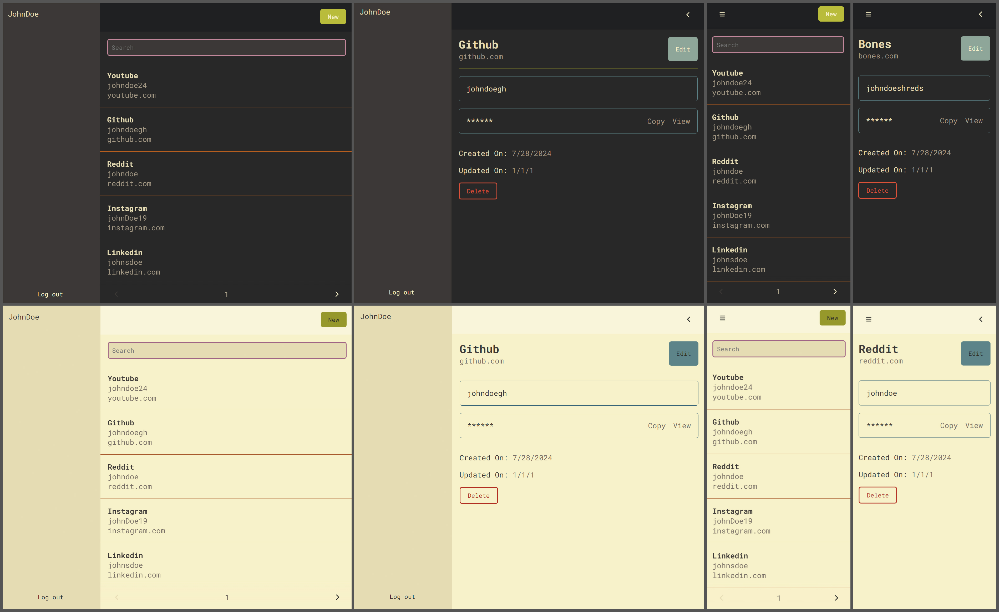

# Password manager
A self hostable password manager made using .NET Core and Vue3
### Features
- Multiple accounts for friends and family
- Client side encryption
- Light and dark mode
- Mobile first design
- Auto generate secure passwords
- Import/Export passwords from CSV
- Deploy with Docker
### How to deploy
```bash
git clone https://github.com/IsaiahPaget/PasswordManager.git
cd PasswordManager
sh startup.sh
```
update the password values and signing key in the .env files and appsettings.json

```bash
docker-compose -f ./src/docker-compose.yml up -d
```

### Preview

With a Gruvbox theme <3
